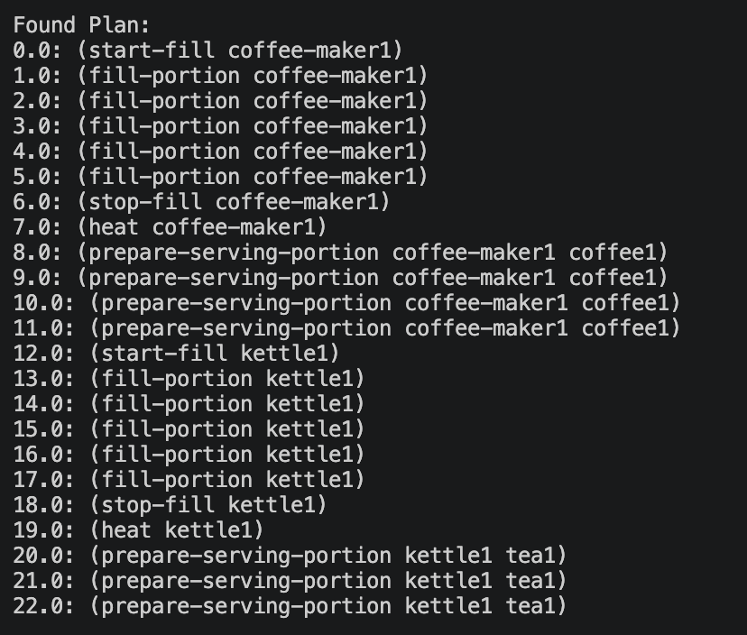
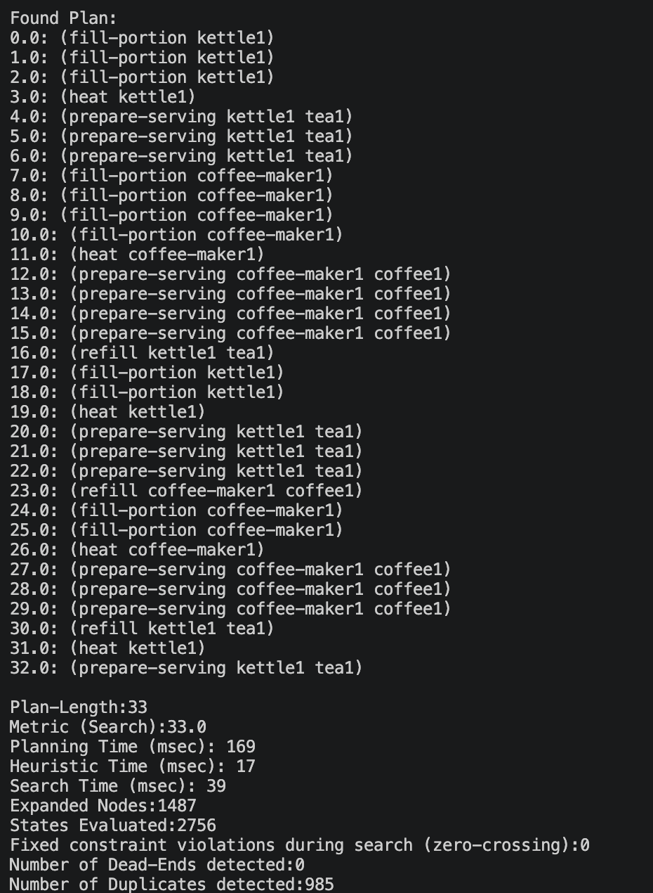
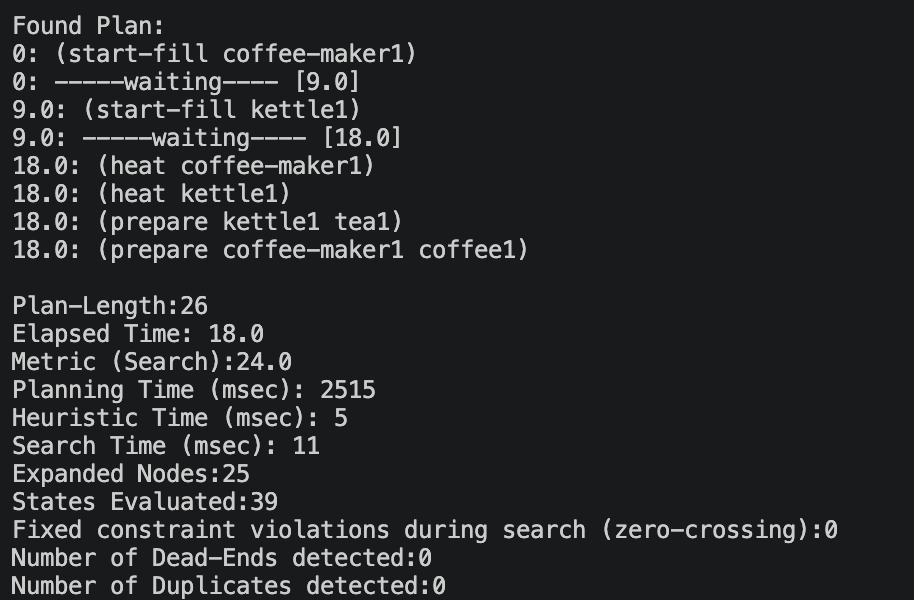
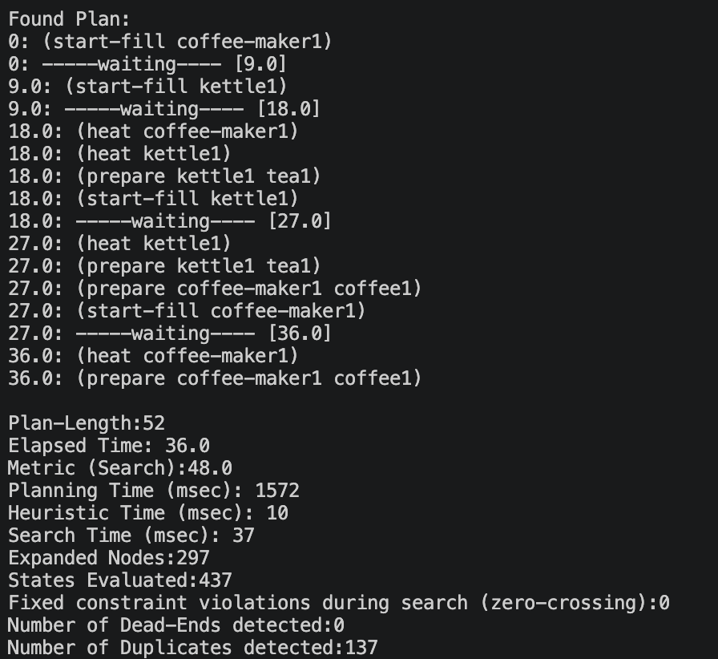

AI4RO_assignment
# Assignment D2-V6: Domestic Service Robot – Appliance Capacity Constraints

### Scenario
A robot prepares beverages using kitchen appliances such as a kettle and a coffee machine. These appliances have limited capacity (maximum volume or portions of water that can be heated or processed at once).
The robot manage resources efficiently, ensuring that capacity constraints are respected while completing preparation tasks.

### Domain Characteristics
- Robot: single manipulator
- Environment: kitchen with appliances (kettle and coffee maker)
- Tasks: preparation involving shared resources
- Constraints: appliance capacity limits

## Modelling
The task of preparing coffee and tea beverages is devided into the action of filling appliance with water, heating the appliance and then lastly prepare the beverage. The capacity constraints prevent the appliances from being treated as unlimited resources.

### Q1 Basic PDDL Model
With the basic PDDL model, appliance capacity is modelled as a maximum number of discrete portions. The action of fill-portion, only fills one portion at a time, but it has to fill the appliance full before it can heat and prepare. This modelling choice is not optimal because the robot ends up making more than what is demanded. The appliance has to be heated before it can prepare the beverage portions, and the appliances cannot be filled with water again until it has prepared all portions of beverages. In order to do this, the action refill is implemented. 
- Problem 1a is where capacity is sufficient, meaning the beverage goal portions is less than the maximum capacity for each appliance.
- Problem 1b is where capacity constraints require multiple operations, meaning the robot needs to refill the appliances in order to reach the goal volume.

#### Plans of Basic PDDL Model

<table>
  <tr>
    <td align="center">
       
      <b>Figure 1.</b> Sufficient discrete capacity model (plan_1a)
    </td>
    <td align="center">
       
      <b>Figure 2.</b> Insufficient discrete capacity model (plan_1b)
    </td>
  </tr>
</table>

### Q2 PDDL+ Model
In the PDDL+ model, the appliance capacity is modelled as continous volume represented as milliliters. 
The domain is kept simple where only the action of filling water is modelled as a process with an overflow-event. By adding this event, the robot is forced to fill the appliance until it is full, before it can put it on heat. Like in the discrete case, this modelling choise may not be optimal. An improvement of this could possibly be to implement a stop-filling action the robot could execute before the overflow-event happens.

All actions should be modelled with a process and event in order to give a better representation of the real world, and how timing affects the plans. This includes both the heating and beverege preparing. It is however not implemented yet.

The function `fill-rate` represent how fast the current volume increases as water is filled.

#### Plans of PDDL+ Model

<table>
  <tr>
    <td align="center">
       
      <b>Figure 1.</b> Sufficient continous capacity model (plan_2c)
    </td>
    <td align="center">
       
      <b>Figure 2.</b> Insufficient continous capacity model (plan_2e)
    </td>
  </tr>
</table>

## Discussion
#### Modelling shared resources
The shared resource in this model is the kitchen tap. Both appliances, the kettle and the coffee-maker, need to be filled with water in order to complete the goals. But since there is only one sink, only one appliance can use it at a time. This is ensured by a Mutex using the global predicate `tap-in-use`. By requiring `(not (tap-in-use)` in the `start-fill` action and not releasing until full in the `stop-fill` action, the "Symmetry Trap" is prevented. 

#### Discrete vs continuous capacity representations
In the discrete case, two modelling options are available. The choice is between numeric fluents to represent discrete portions (like done in this model) or predicates with symbolic constraints (like using empty, half-full, full predicates to indicate volume). Even tho the planner models portions, time is treated as non-existent where the water "teleports" into the appliances portion-by-portion. 

The continous capacity model in PDDL+ allows the filling process to increase continously in time using a `:process` instead of `action`. This approach is more real-world-like because it accounts for the temporal window where the robot actually has to wait for the physical process to finish. 

## Usage
Run using this enhsp-20.jar with `\-s WAStar -wh 2`